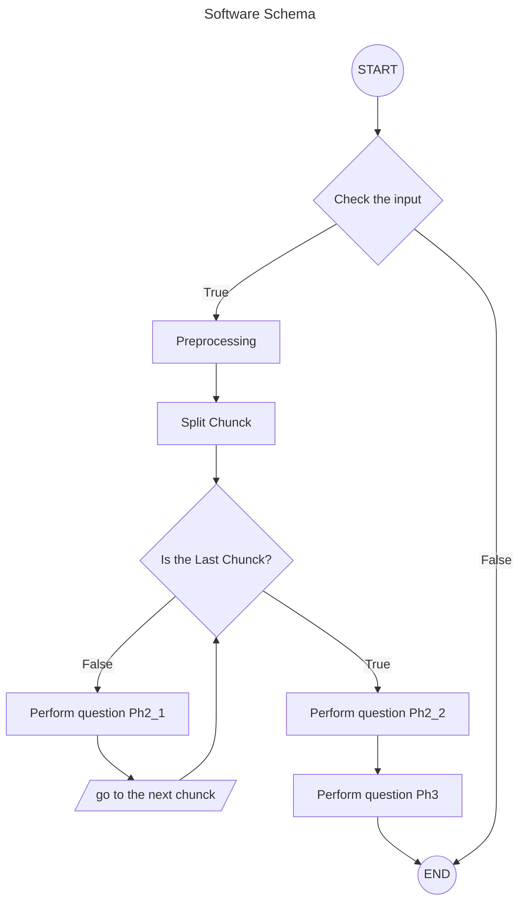

# Generative AI-powered thematic analysis


## D.3.1 Applicazione software dimostrativa della fattibilità del modello

## Progetto di ricerca

**“Sistemi AI per le infrastrutture critiche”** *(Progetti Programma Regionale “RIPARTI
(assegni di Ricerca per riPARTire con le Imprese)” POC PUGLIA FESRTFSE 2014/2020 –
CUP: F87G22000270002), codice assegno 72.*


* Deliverable: **D.3.1**
* Linguaggio: Python 3.11
* Sistema operativo supportato: Linux, Unix, MacOS

È possibile l'utilizzo di Windows avvalendosi di sistemi di virtualizzazione o *container*.

**N.B.:** Utilzzare Python 3.11. la libreria aiohtml non supporta la versione 3.12

## Introduzione
L'analisi tematica è una tecnica di analisi qualitativa dei dati volta a individuare il contenuto rilevante di un testo o di un insieme di testi, attraverso una loro riorganizzazione sotto forma di sintesi tematica e raggruppamenti categoriali.

Il processo di analisi tematica prevede generalmente sei fasi (cfr. Braun & Clarke, 2006). Prima di iniziare un'analisi tematica, i ricercatori devono identificare una domanda di 
ricerca, rendere operativa un'ipotesi e condurre la ricerca. I dati utilizzati per l'analisi tematica devono essere di tipo qualitativo.

### Fasi dell'analisi tematica (Braun & Clarke, 2006)

1. **Rileggere i dati:** il ricercatore li familiarizza rileggendoli più volte. Durante la lettura dei dati, il ricercatore prende nota dei propri pensieri in merito ai dati;
2. **Decidere i codici preliminari:** l'organizzazione sistematica dei dati è il processo iniziale. Il ricercatore deve categorizzare i codici dei dati in base ai temi chiave che ha identificato;
3. **Identificare i temi nei dati:** i temi identificati si basano sui modelli che i ricercatori hanno individuato nei dati. In questa fase, i ricercatori identificano l'eventuale presenza di temi nei dati codificati. I temi identificati forniscono un contesto più ampio per i dati codificati.
4. **Verifica dei temi:** in questa fase vengono modificati i temi. I temi vengono controllati per verificare se supportano i dati. Se i temi non supportano i dati, possono togliere contesto ai dati stessi.
5. **Definizione dei temi:** i temi vengono finalizzati, i sottotemi vengono definiti e il ricercatore giustifica il modo in cui i temi e i sottotemi sono collegati.
6. **Report dei risultati:** questa è la fase finale, in cui il ricercatore spiega i risultati ottenuti. In questa fase, il ricercatore deve giustificare i codici e i temi trovati per dimostrare che non sono stati influenzati da pregiudizi (che riducono la validità della ricerca). Il ricercatore scriverà i codici e i temi trovati nella relazione e fornirà estratti di dati come supporto.

### Note e limiti del software:

Come conseguenza delle limitazioni d'utilizzo della versione gratuita dell'API di chatGPT, il software implementerà le fasi 2, 3 e 5. Il completamento delle fasi 1 e 4 è lasciato al ricercatore.

### Funzionalità implementate nel software:
* **Preprocessamento del testo:**
	1. conversione di tutti i caratteri in minuscolo e dei numeri in parole;
	2. rimozione della punteggiatura, accenti e altri diacritici;
	3. rimozione degli spazi bianchi e stop-words (congiunzioni, articoli, etc.);
	4. divisione del testo in chunk (di un certo numero di caratteri) in base ai limiti imposti dall'API di chatGPT.
* **Analisi tematica del testo**
* **Produzione di un file contentente in forma tabellare:**
	1. Nome del tema;
	2. Descrizione del tema;
	3. Tre estratti di testo significativi per ciascun tema.


## Installazione 

> [!NOTE] 
> Non è necessario indicare nulla sull'API KEY. il programma cerca nella home dell'utente un file chiamato *.themAnalysis.yml* se non lo trova chiede all'utente di inserire l'api key che poi viene salvata nel file.

La procedura temporanea di installazione è la seguente:

```console
python3 -m pip install git+https://github.com/Oronzo-Mazzeo/D.3.1_ThematicAnalysis
```

Se si vuole usare un ambiente virtuale, prima di procedere all'installazione, bisogna eseguire i seguenti comandi:

```console
python3 -m venv venv
source venv/bin/activate
```


## Uso
```console
themAn [OPTIONS] [FILENAME] 
```
dove filename è l'intervista da analizzare.
Nel caso si vogliano analizzare più interviste è necessario utiliuzzare l'opzione *--folder*.

|Parametro|Desscrizione|
|---|---|
| --folder, -f| Directory contenente le interviste|
|--csv, -c| Inizia l'analisi a partire dal prodotto intermedio CSV|
| --output, -o | Output filename. **Default:** *output.txt*|
| --ai, -a | Seleziona il motore di intelligenza artificiale da usare.<br/> Valori ammessi: ChatGPT, Bard[^1]<br/> **Default:** *ChatGPT*|
|--wait-time, -w| Numero di secondi tra le richieste. Necessario a caiusa delle limitazioni delle API gratuite. Può essre disabilitato impostando il valore a 0. **Deafult:** *20*.
| --language ,-l | Selezione della lingua da utilizzare. <br/>Valori ammessi: *it*, *en*. <br/>**Default:** *en*|
| --split/--no-split | Abilita o disabilita la divisione delle interviste in segmenti. **Default:** *split*|
| --stopw/--no-stopw  | Abilita o disabilita la rimozione delle *stop words*. **Default:** *stopw*|
| --n-words, -n | Numero di parole per ogni segmento [^2]. **Default:** *2000*|
| --prefix, -p | Prefisso da per inomi dei file dei vari segmenti[^2]. **Default:** *chunk*|
| --legacy, -L | Utilizza il motore AI *text-davinci-002*[^3] al posto di *gpt-3.5-turbo* [^4]|
| --help, -h| visualizza il messaggio di aiuto|

[^1]: Solo parzialmente supportato.
[^2]: l'opzione viene ignorata se è selezionata l'opzione *--no-split*.
[^3]: Il motore verrà dismesso agli inizi del 2024.
[^4]: L'opzione verrà ignorata se si utilizza una AI diversa da ChatGPT.

Nel successivo grafico è riportato lo schema di funzionamento del software:

